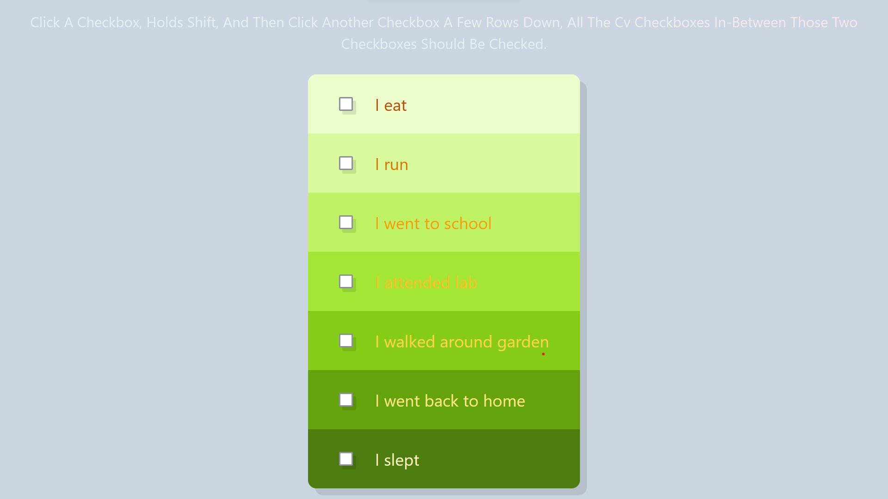

# Hold Shift And Check or Uncheck Checkboxes

This is a solution to the [Hold Shift And Check or Uncheck Checkboxes]() This is challenge from WesBos to train beginners Vanilla JS. This is Day1 Project.  

## Table of contents

- [Overview](#overview)
  - [The challenge](#the-challenge)
  - [Screenshot](#screenshot)
  - [Links](#links)
- [My process](#my-process)
  - [Built with](#built-with)
- [Author](#author)

## Overview

### The challenge

Users should be able to:

- Click on checkbox as if he/she holds shiftkey then and he/she clicks on next checkbox every checkbox between them should be checked and vice-verse.
### Screenshot

### Links

- Solution URL: [Solution URL here](https://www.github.com/hold-shiftkey-and-check-or-uncheck-checkboxes/)
- Live Site URL: [Live site URL here](https://ashraful-fuqha.github.io/hold-shiftkey-and-check-or-uncheck-checkboxes/)

## My process

### Built with

- Semantic HTML5 markup
- Flexbox
- TailwindCSS 
- Vanilla JS

## Author

- Website - Definetly
- GitHub - [@MjafarsadiqD](https://github.com/Ashraful-Fuqha)